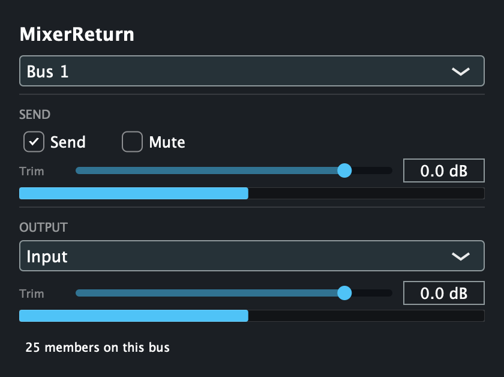
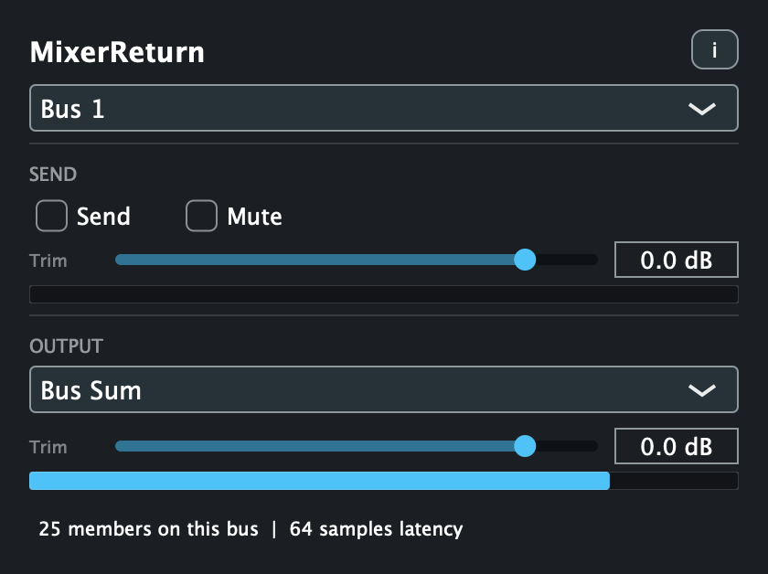

# MixerReturn

> **AI-assisted project.** This codebase was created with [Claude](https://claude.com/claude-code)
> (Anthropic), directed and reviewed by a human author. The summing bus has been verified
> numerically against the actual shipped processor class — a one-block delay with the
> summing instance processed both first and last, 24 senders with the host's processing
> order reshuffled on every block, 400 blocks with 17 instances racing on their own
> threads, plus trim, mute, bypass participation and bus isolation (`mrtest`), and it is
> clean under ThreadSanitizer. `pluginval` passes clean at strictness 8 on VST3, and on AU
> with one known benign wrapper warning. It **has** been run with real audio in Waves
> SuperRack Performer v15.15.12 on macOS, over a loopback virtual device: pass-through is
> bit-exact and adds no delay, the sum equals the sum of its senders delayed by exactly one
> block with 0 of 143744 samples in error, trim and mute are exact, and a bypassed instance
> contributes zero without wedging the barrier. It has **not** been run against a real
> console and **not** been used on a show. Every claim about SQ behaviour comes from the
> reference guide, not from hardware. Review before use on live gear.

Bolt a Dugan Automixer onto a console that hasn't got one — post-fader, without spending an
insert slot or a second channel strip per mic.

<!-- downloads:start -->

## Download

**[v0.3.0](https://github.com/stoatworks-labs/mixerreturn/releases/tag/v0.3.0)** — prebuilt for macOS, Windows and Linux. Pick your platform:

<details>
<summary><b>macOS</b> — Universal (Apple Silicon + Intel)</summary>

| Build | Download | Size |
| --- | --- | --- |
| Universal (Apple Silicon + Intel) · .dmg disk image | [`mixerreturn-0.3.0-macos-universal.dmg`](https://github.com/stoatworks-labs/mixerreturn/releases/download/v0.3.0/mixerreturn-0.3.0-macos-universal.dmg) | 11 MB |
| Universal (Apple Silicon + Intel) · .pkg installer | [`mixerreturn-0.3.0-macos-universal.pkg`](https://github.com/stoatworks-labs/mixerreturn/releases/download/v0.3.0/mixerreturn-0.3.0-macos-universal.pkg) | 9.8 MB |
| Universal (Apple Silicon + Intel) · .zip archive | [`mixerreturn-macos-universal.zip`](https://github.com/stoatworks-labs/mixerreturn/releases/latest/download/mixerreturn-macos-universal.zip) | 9.5 MB |

</details>

<details>
<summary><b>Windows</b> — x64, ARM64</summary>

| Build | Download | Size |
| --- | --- | --- |
| x64 · .exe installer | [`mixerreturn-0.3.0-windows-x86_64-setup.exe`](https://github.com/stoatworks-labs/mixerreturn/releases/download/v0.3.0/mixerreturn-0.3.0-windows-x86_64-setup.exe) | 2.8 MB |
| ARM64 · .exe installer | [`mixerreturn-0.3.0-windows-aarch64-setup.exe`](https://github.com/stoatworks-labs/mixerreturn/releases/download/v0.3.0/mixerreturn-0.3.0-windows-aarch64-setup.exe) | 2.6 MB |
| x64 · .zip archive | [`mixerreturn-windows-x86_64.zip`](https://github.com/stoatworks-labs/mixerreturn/releases/latest/download/mixerreturn-windows-x86_64.zip) | 5.1 MB |
| ARM64 · .zip archive | [`mixerreturn-windows-aarch64.zip`](https://github.com/stoatworks-labs/mixerreturn/releases/latest/download/mixerreturn-windows-aarch64.zip) | 4.9 MB |

</details>

<details>
<summary><b>Linux</b> — x64, ARM64</summary>

| Build | Download | Size |
| --- | --- | --- |
| x64 · .deb package (Debian/Ubuntu) | [`mixerreturn_0.3.0_amd64.deb`](https://github.com/stoatworks-labs/mixerreturn/releases/download/v0.3.0/mixerreturn_0.3.0_amd64.deb) | 2.1 MB |
| ARM64 · .deb package (Debian/Ubuntu) | [`mixerreturn_0.3.0_arm64.deb`](https://github.com/stoatworks-labs/mixerreturn/releases/download/v0.3.0/mixerreturn_0.3.0_arm64.deb) | 2.2 MB |
| x64 · .rpm package (Fedora/RHEL) | [`mixerreturn-0.3.0-1.x86_64.rpm`](https://github.com/stoatworks-labs/mixerreturn/releases/download/v0.3.0/mixerreturn-0.3.0-1.x86_64.rpm) | 2.2 MB |
| ARM64 · .rpm package (Fedora/RHEL) | [`mixerreturn-0.3.0-1.aarch64.rpm`](https://github.com/stoatworks-labs/mixerreturn/releases/download/v0.3.0/mixerreturn-0.3.0-1.aarch64.rpm) | 2.2 MB |
| x64 · .zip archive | [`mixerreturn-linux-x86_64.zip`](https://github.com/stoatworks-labs/mixerreturn/releases/latest/download/mixerreturn-linux-x86_64.zip) | 4.2 MB |
| ARM64 · .zip archive | [`mixerreturn-linux-aarch64.zip`](https://github.com/stoatworks-labs/mixerreturn/releases/latest/download/mixerreturn-linux-aarch64.zip) | 4.2 MB |

</details>

All builds, checksums and release notes: [github.com/stoatworks-labs/mixerreturn/releases](https://github.com/stoatworks-labs/mixerreturn/releases).

macOS builds are signed and notarised and open normally. The Windows builds are unsigned, so SmartScreen warns once.

<!-- downloads:end -->

## What it's for

MixerReturn is an interface for **Waves SuperRack Performer**. It lets the Dugan Automixer
run across a console's channel **direct outs**, and returns the automixed result summed down
to a **single stereo pair**, which comes back into a **group's External Input**.

The point is what it *doesn't* cost you. Because the automixer works on the direct outs
rather than on channel inserts:

- **The insert slots stay free.** You can still insert plugins on the channel strips exactly
  as normal — the automixer isn't competing for them.
- **The automixer sits post-fader**, without relocating any insert points.
- **No channel is used twice.** One channel strip per mic, as usual.

In short, it adds an automixer to a desk without taking anything away from it.

| A channel instance | The return instance |
| --- | --- |
|  |  |

*Both rendered from the real editor by `mrshot`, with a full 24-channel rig registered on
the bus — which is why the member count and the latency readout are the actual values, not
a mock-up.*

MixerReturn is a VST3/AU/Standalone plugin that gives a plugin host something it doesn't
otherwise have: a **shared summing bus** spanning many instances. Put one instance in a rack
fed from each automixed channel, and one more instance set to output the sum. That sum
returns to the desk as a mix's External Input. Note the feeding rack is a *second* rack per
mic, not the one running the automixer — see [the signal flow](#the-signal-flow) below.

## The signal flow

```
SQ channels 1-24
  |  direct outs, set to follow the fader
  v
SLink / Dante / Waves card  ---->  SuperRack Performer
                                     Rack 1..24:   [your plugins] -> Dugan (output stage)
                                                          |  output patch, then loopback I/O
                                                          v
                                     Rack 25..48:  MixerReturn (Send)
                                     Rack 49:      MixerReturn (Bus Sum)
                                                                          |
SQ mix "External Input"  <-------------------------------------------------
```

The operator keeps working ordinary channel strips. Dugan sees post-fader signals. No
insert slots are consumed and no channel is used twice.

**It is two racks per mic.** SuperRack's Dugan is part of a rack's *output stage*, after all
eight plugin slots, and there is no Dugan to insert as a plugin — so nothing in a rack can be
downstream of it. A MixerReturn sharing a rack with the Dugan sends the signal from *before*
the automixer, and the return carries a plain sum with no automixing in it. Measured: rack
outputs automixed to −4.39 dB while a same-rack MixerReturn's sum carried them at +0.02 dB.
The second rack, fed over a loopback pair, is what picks the automixed signal back up. See
[the user guide](docs/USER-GUIDE.md#the-signal-flow).

## Why this exists

SuperRack's patcher allows **only one rack per output I/O**, so twenty-four rack outputs
cannot be patched onto one output to sum them. The desk can't sum them either without
spending twenty-four input channels to do it. This fills that one gap.

## Controls

| Control | What it does |
| --- | --- |
| **Bus** | Which of the 8 shared buses this instance joins. |
| **Send** / **Mute** | Whether this instance contributes its input to the bus. |
| **Send Trim** | -inf to +10 dB on the contribution, matching the SQ's own direct out trim range. |
| **Output** | `Input` (pass through), `Bus Sum` (emit the sum), or `Input + Bus Sum`. |
| **Output Trim** | -inf to +10 dB on this instance's output. |

Sending and receiving are independent, so an instance can be a sender, a receiver, or both.

## The one thing to know

The bus sum is delayed by **exactly one block**, identically for every sender, no matter
what order the host processes the instances in. That uniformity is deliberate and is the
reason the design looks the way it does — a shorter but *uneven* delay across channels
would comb-filter the sum. See [docs/DESIGN.md](docs/DESIGN.md).

## Setting it up on an Allen & Heath SQ

Two console-side details that will bite otherwise:

- **"Follow Fader" on direct outs is global across all 48 channels.** There is no
  post-fader tap point; post-fader comes from that separate switch, and it is all-or-nothing.
  If you also multitrack off direct outs, that recording becomes post-fader too. Route
  multitrack over **tie lines** (post-preamp, bypassing the processing path) instead.
- **Unroute the automixed channels from the main mix.** The summed return must be their
  only path there. A channel reaching the mix both directly and through the return will comb.
  Pre-fader monitor sends stay inside the desk and are fine.

The SQ core runs at 96 kHz, so the plugin host must too.

## Building

```bash
cmake -B build -DCMAKE_BUILD_TYPE=Release && cmake --build build
```

VST3, AU and Standalone land under `build/`. `mrtest` is a headless numerical check of the
summing bus, `mrhost` runs that same check through the built VST3 as a host would, and
`mrshot` regenerates the screenshots above:

```bash
./build/mrtest_artefacts/Release/mrtest
```

```bash
./build/mrhost_artefacts/Release/mrhost build/MixerReturn_artefacts/Release/VST3/MixerReturn.vst3
```

## Status

v0.3.0. The summing bus is verified numerically — including 24 senders with the processing
order reshuffled on every block, and 17 instances processing concurrently on their own
threads — it is clean under ThreadSanitizer, `pluginval` passes at strictness 8, and the
built VST3 has been loaded as a host loads it, confirming that instances created from one
bundle really do share a bus.

**It has now also been run with real audio inside SuperRack Performer** (v15.15.12, 48 kHz,
256-sample buffer, I/O over a loopback virtual device). Pass-through is bit-exact and adds no
delay; the sum equals the sum of its senders delayed by exactly one block, uniform across
every sender, with 0 of 143744 samples in error; −6 dB of send trim comes back as −6.00 dB;
a muted send comes back as exactly zero; a bypassed instance contributes zero without wedging
the barrier. That testing is also what found the two-rack topology above, and a latency
report that was eight times too high.

It has **not** been run against a real SQ or any console. Nothing here has been near a live
show, and every claim about console behaviour still comes from the reference guide.

That concurrent test earned its place: it found a real bug that every sequential test
passed straight through. The audio path used to take a process-wide try-lock and skip the
block when it lost, which is invisible on one thread and drops instances out of the sum on
several. [docs/DESIGN.md](docs/DESIGN.md) has the detail.

## Roadmap

Phase 2 is the original idea: a virtual audio device that wraps a CoreAudio/ASIO/WDM device,
passes its I/O through, and adds summable virtual ports named `Sum n`.

**The device is the product; the plugin is the version that works without installing one.**

Once the wrapper exists, a rack's output patch *is* the routing decision — physical output to
behave as an insert, or a `Sum` port to feed the buses — with no plugin in the chain at all.
The wrapper is also strictly better technically: a driver receives every Sum port in one
callback, so it can sum with **no added delay**, where the plugin must cost a block. The
entire two-page barrier in this plugin exists only because plugin instances cannot see each
other's timing; a driver has no such problem.

What the plugin still gives you, honestly and completely: it exists today; it needs no driver
install, no admin rights, no notarized system extension and no signed kernel driver; it does
not depend on successfully wrapping any particular interface; and it therefore runs on locked
down or rented machines where a system audio device is not an option. That is "easier to
deploy", not "does something the device cannot". The one capability gap runs the other way —
routing between separate applications, which a per-process plugin bus can never do.

**The target host is SuperRack Performer, not SoundGrid.** An earlier version of this
document claimed Phase 2 would cover SuperRack SoundGrid; that was wrong. SoundGrid racks
take their I/O from SoundGrid network hardware rather than from a CoreAudio or ASIO device,
so a virtual audio device is not visible to SuperRack SoundGrid as rack I/O at all. The
SoundGrid *driver* is a different matter — it presents CoreAudio/ASIO to the computer like
any other interface, so it could in principle be the device being wrapped. That is reasoning
from how the pieces fit, not something tested.

The control surface for it lives in [client/](client/).

## Licence

MIT. See [LICENSE](LICENSE).
